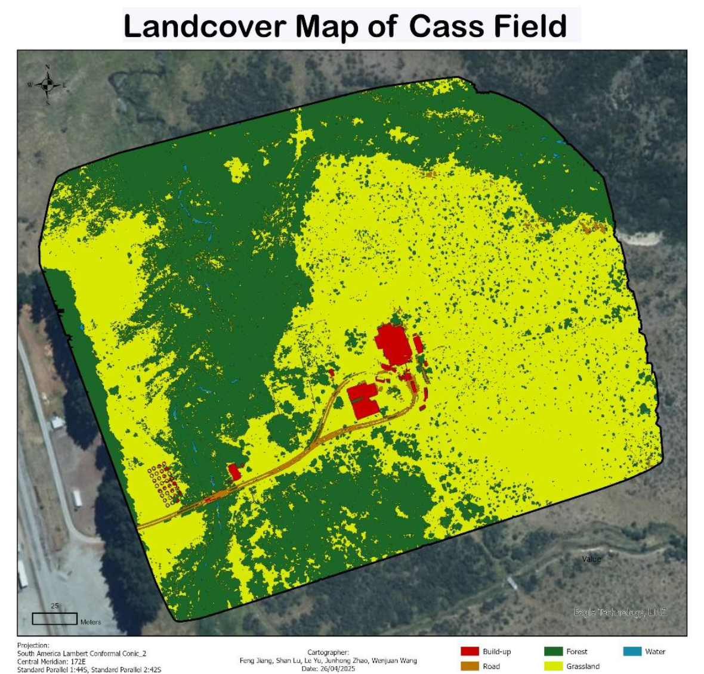

# UAV Land-Cover Classification with Object-Based SVM

Object-based supervised classification of five-band UAV multispectral imagery over Cass Field, New Zealand, into five land-cover classes: **built-up areas, grassland, forest, roads, and water**.

*Completed as a University of Canterbury group project (2025); I was responsible for training-sample preparation, object-based SVM classification, spectral-confusion review, post-classification refinement and final mapping.*

## Study Area and Imagery

The study focused on Cass Field in Canterbury, New Zealand. The input was five-band multispectral imagery collected by a DJI UAV at approximately 0.05 m spatial resolution. The very high resolution captured detailed vegetation texture, buildings, roads, shadows and bare ground, but also increased within-class spectral variation and pixel-level noise.

| Item | Detail |
|---|---|
| Study area | Cass Field, Canterbury, New Zealand |
| Sensor | DJI UAV multispectral |
| Bands | 5 |
| Ground resolution | ~0.05 m |
| Target classes | Built-up, grassland, forest, roads, water |

## Training Samples

*Figure 1. Representative training samples used to label the five land-cover classes.*

## Method

The imagery has very high spatial resolution, so individual pixels contain substantial local variation from vegetation texture, shadows, bare ground and building materials. A purely pixel-based classifier therefore produced fragmented results and visible salt-and-pepper noise.

To improve spatial consistency, the image was first segmented into spatially coherent objects and then classified with a Support Vector Machine (SVM) in ArcGIS Pro. SVM was selected because it can work effectively with limited training samples and multi-band input data.

Steps:

1. Used all five spectral bands without dimensionality reduction.
2. Segmented the UAV image into spatially coherent objects.
3. Manually labelled representative samples for each land-cover class.
4. Trained an object-based SVM classifier.
5. Reviewed the output and corrected clear spectral-confusion errors with raster-based rules.

## Final Land-Cover Map

  

  <em>Figure 2. Final land-cover map of Cass Field showing built-up areas, grassland, forest, roads and water.</em>

The final map clearly separates the dominant forest and grassland areas while preserving smaller features such as buildings, roads and water.

The main classification errors were caused by similar spectral responses:

- bright building surfaces were sometimes confused with grassland;
- bare ground was sometimes classified as road;
- building shadows were sometimes classified as water.

Targeted post-classification refinement reduced these obvious errors and produced a cleaner final map.

*Figure 3. Raw classification (left) compared with the refined result (right) after post-classification correction.*

## Workflow

- Reviewed the five-band UAV multispectral imagery and defined the target land-cover classes.
- Manually created representative training samples for built-up areas, grassland, forest, roads and water.
- Produced a pixel-based supervised classification as a baseline.
- Segmented the imagery into spatially coherent objects.
- Trained an object-based Support Vector Machine classifier using all five spectral bands.
- Compared the spatial coherence of the pixel-based and object-based outputs.
- Reviewed spectral-confusion errors and applied raster-based post-classification refinement.
- Produced the final land-cover map and documented limitations.

## Skills Demonstrated

**Object-based image analysis (OBIA) · SVM supervised classification · image segmentation · post-classification refinement · ArcGIS Pro raster workflows.**

## Reproducibility

Performed in ArcGIS Pro using: **Segment Mean Shift → Train SVM Classifier → Classify → Raster Calculator** for post-classification refinement. *(If your tool names differ, adjust this line to match what you actually used.)*

## Limitations

Independent ground-truth data were not available, so a formal external accuracy assessment is not reported. The final map should therefore be interpreted as a supervised-classification workflow and spatial interpretation exercise rather than a production-ready land-cover dataset.

The refinement stage also included analyst review, meaning that some corrections depend on visual interpretation and local knowledge of the study area.

## Tools and Methods

**ArcGIS Pro · Object-Based Image Analysis · Support Vector Machine · UAV Multispectral Imagery · Image Segmentation · Raster Calculator**

---

Questions or feedback? Reach me at nicole140002@gmail.com
