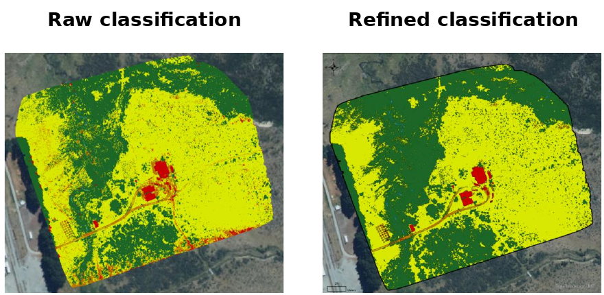
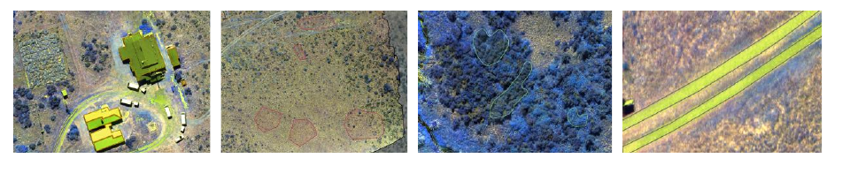

# UAV Land-Cover Classification with Object-Based SVM

Object-based supervised classification of five-band UAV multispectral imagery over Cass Field, New Zealand, into five land-cover classes: **built-up areas, grassland, forest, roads, and water**.

## Overview

The imagery has very high spatial resolution, so individual pixels contain substantial local variation from vegetation texture, shadows, bare ground, and building materials. A purely pixel-based classifier therefore produced fragmented results and visible salt-and-pepper noise.

To improve spatial consistency, the image was first segmented into meaningful objects and then classified with a Support Vector Machine (SVM) in ArcGIS Pro. SVM was selected because it can work effectively with limited training samples and multi-band input data.

## Method

1. Used all five spectral bands without dimensionality reduction.
2. Segmented the UAV image into spatially coherent objects.
3. Manually labelled representative samples for each land-cover class.
4. Trained an object-based SVM classifier.
5. Reviewed the output and corrected clear spectral-confusion errors with raster-based rules.

The object-based result forms more continuous land-cover patches, while the pixel-based output is more fragmented and sensitive to small spectral variations.

## Key Results

The final map clearly separates the dominant forest and grassland areas while preserving smaller features such as buildings, roads, and water.

The main classification errors were caused by similar spectral responses:

- bright building surfaces were sometimes confused with grassland;
- bare ground was sometimes classified as road;
- building shadows were sometimes classified as water.

Targeted post-classification refinement reduced these obvious errors and produced a cleaner final map.

## Limitations

Independent ground-truth data were not available, so a formal external accuracy assessment is not reported. The final map should therefore be interpreted as a supervised-classification workflow and spatial interpretation exercise rather than a production-ready land-cover dataset.

The refinement stage also included analyst review, meaning that some corrections depend on visual interpretation and local knowledge of the study area.

## Tools and Methods

**ArcGIS Pro · Object-Based Image Analysis · Support Vector Machine · UAV Multispectral Imagery · Image Segmentation · Raster Calculator**

## Project Context

This work was completed as part of a University of Canterbury group coursework project. My contribution focused on preparing training samples, running the object-based SVM classification, reviewing classification errors, refining the raster output, and producing the final land-cover map.

